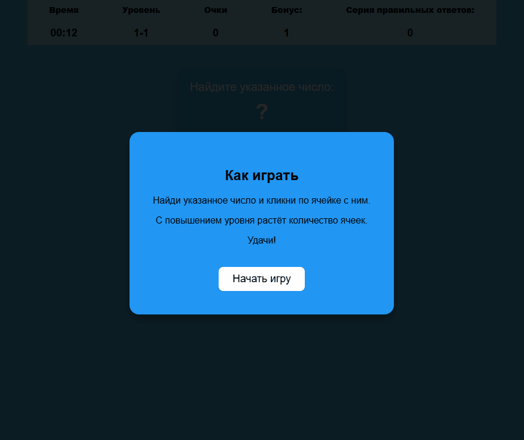

# Найди число — игра

**Описание:**  
    Браузерная игра, основная цель которой - найти указанное число среди представленных на экране.

---

## Как играть

- В верхней части экрана отображается число, которое нужно найти.
- В сетке из 6 чисел (3 на 2) нажимайте на число, которое совпадает с заданным.
- За правильный ответ начисляются очки, игра продолжается.
- Игра идет на время — 60 секунд.

---

## Технологии

- HTML
- CSS
- JavaScript

---

## Запуск проекта

Необходимо открыть `index.html` в любом современном браузере.

---

## Особенности

- Анимации появления чисел и кликов на них.
- Система бонусов: очки увеличиваются за каждое второе подряд правильное нажатие.
- Экран окончания игры с итоговым счетом и кнопкой "Начать заново".

---

## Демонстрация

---

## Автор

Yuri Zhaglov
